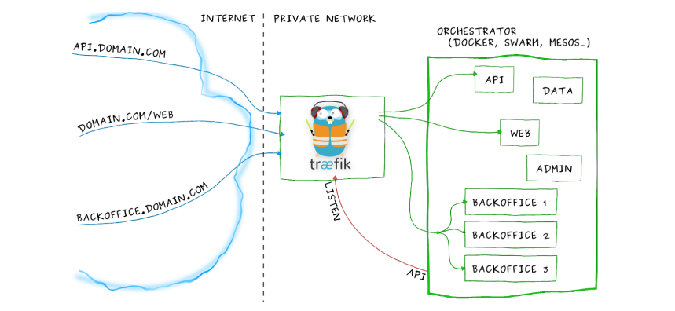

<p align="center">
    
</p>

# Docker Compose Traefik - Proxy Container Service (HTTP :80)

This guide shows you how to deploy your containers behind Traefik reverse-proxy.

## Run on Local Computer

Docker container:

-   Docker Socket Proxy (security) [Document](https://hub.docker.com/r/tecnativa/docker-socket-proxy/#!)
-   Traefik [Document](https://hub.docker.com/_/traefik)
-   Logger (logrotate & cron) `Custom for Alpine`
-   Portainer (Optional) [Document](https://www.portainer.io/)

### Step 1: Make Sure You Have Required Dependencies

-   Git
-   Docker
-   Docker Compose

#### Example Installation on Debian-based Systems:

Official documentation for install Docker with new Docker Compose V2 [doc](https://docs.docker.com/engine/install/), and you can install too Docker Compose V1. Follow official documentation.

```
sudo apt-get install git docker-ce docker-ce-cli containerd.io docker-compose-plugin
```

### Step 2: Clone the Repository

```bash
git clone https://github.com/asapdotid/dcc-traefik-http.git
cd dcc-traefik-http
```

Make command help:

```bash
make help
```

### Step 3: Make Initial Environment Variables

```bash
make init
```

Modified file in `.make/.env` for build image

```ini
# Project variables
DOCKER_REGISTRY=docker.io
DOCKER_NAMESPACE=asapdotid
DOCKER_PROJECT_NAME=proxy
```

### Step 3: Make Initial Environment Variables

```bash
make set-init
```

Modified file in `src/.env` for build image

### Step 4: Set Your Own Password

Note: when used in docker-compose.yml all dollar signs in the hash need to be doubled for escaping.

> Install `Apache Tools` package to using `htpasswd`
> To create a `user`:`password` pair, the following command can be used:

```bash
echo $(htpasswd -nb user)

# OR

echo $(htpasswd -nb user password)
```

Running script:

```bash
echo $(htpasswd -nb admin)

New password:
Re-type new password:

admin:$apr1$W3jHMbEG$TCzyOICAWv/6kkraCHKYC0
```

or

```bash
echo $(htpasswd -nb admin adminpass)

admin:$apr1$W3jHMbEG$TCzyOICAWv/6kkraCHKYC0
```

The output has the following format: `username`:`password_hash`. The username doesn't have to be `admin`, feel free to change it (in the first line).

Encode password hash with `base64`:

```bash
echo '$apr1$W3jHMbEG$TCzyOICAWv/6kkraCHKYC0' | openssl enc -e -base64
JGFwcjEkVzNqSE1iRUckVEN6eU9JQ0FXdi82a2tyYUNIS1lDMAo=
```

Check decode:

```bash
echo 'JGFwcjEkVzNqSE1iRUckVEN6eU9JQ0FXdi82a2tyYUNIS1lDMAo=' | openssl enc -d -base64
```

You can paste the username into the `TRAEFIK_BASIC_AUTH_USERNAME` environment variable. The other part, `hashedPassword`, should be assigned to `TRAEFIK_BASIC_AUTH_PASSWORD_HASH`. Now you have your own `username`:`password` pair.

### Step 5: Launch Your Deployment

Create docker network `secure` & `proxy` for external used with other docker containers:

```bash
docker network create secure"
```

and

```bash
docker network create proxy
```

To do copy env and build docker images with make commands:

```bash
make set-init

make build
```

Docker composer make commands:

```bash
make up
# or
make down
```

### Step 6: Additional Docker Service

-   Whoami
-   Portainer

Can remove or command.

### Step 7: Test Your Deployment

```bash
curl --insecure http://{domain_name}/
```

You can also test it in the browser:

http://{domain_name}/

http://monitor.{domain_name}/

## Deploying on a Public Server With Real Domain

Let's say you have a domain `example.com` and it's DNS records point to your production server. Just repeat the local deployment steps, but don't forget to update `TRAEFIK_DOMAIN_NAME` environment variables. In case of `example.com`, your `src/.env` file should have the following lines:

```ini
TRAEFIK_DOMAIN_NAME=example.com
```

Setting correct email is important because it allows Let’s Encrypt to contact you in case there are any present and future issues with your certificates.

## Optinonal add `Portainer` service

Uncomment on docker compose file for `Portainer` service:

File: `src/compose/docker-compose.local.yml`

```yaml
portainer:
    image: portainer/portainer-ce:latest
    restart: unless-stopped
    security_opt:
        - no-new-privileges:true
    networks:
        - secure
        - proxy
    volumes:
        - /etc/localtime:/etc/localtime:ro
        - ../../.data/portainer:/data
    labels:
        - traefik.enable=true
        - traefil.docker.network=proxy
        - traefik.http.routers.portainer.entrypoints=http
        - traefik.http.routers.portainer.rule=Host(`portainer.${TRAEFIK_DOMAIN_NAME}`)
        - traefik.http.services.portainer.loadbalancer.server.port=9000
    depends_on:
        - dockersocket
        - traefik
```

## Internal Docker Compose Service Integrate with Traefik (`Labels`)

Sample:

```yaml
    ...
    labels:
      - traefik.enable=true
      - traefil.docker.network=proxy
      - traefik.http.routers.portainer.entrypoints=http
      - traefik.http.routers.portainer.rule=Host(`app.${TRAEFIK_DOMAIN_NAME}`)
```

Sample `nginx` service:

```yaml
nginx:
    image: nginx:stable
    networks:
        - proxy
    depends_on:
        - traefik
    labels:
        - traefik.enable=true
        - traefil.docker.network=proxy
        - traefik.http.routers.portainer.entrypoints=http
        - traefik.http.routers.portainer.rule=Host(`app.${TRAEFIK_DOMAIN_NAME}`)
```

Read instruction after container up [instruction](docs/portainer.md)

## License

MIT / BSD

## Author Information

This Docker Compose Traefik HTTP was created in 2022 by [Asapdotid](https://github.com/asapdotid) 🚀
